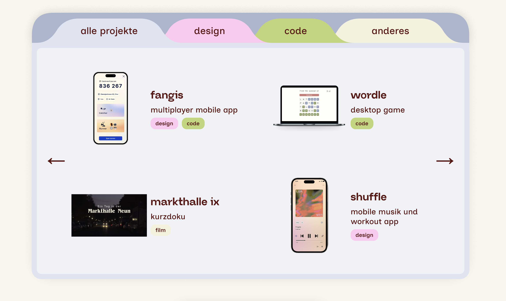

## Stephanies Portfolio
Mein Portfolio stellt einige meiner Projekte vor und vermittelt einen ersten Eindruck, wie meine Arbeit als Designerin aussieht. Mir war es wichtig, durch das Design meine Persönlichkeit zu zeigen und gleichzeitig meine Fähigkeiten zu präsentieren. Das Portfolio enthält viele kleine Animationen und einige versteckte Interaktionsmöglichkeiten.

## Learnings
Da mich interaktive Webelemente faszinieren, wollte ich unbedingt einmal ausprobieren, mit JavaScript selber solche Elemente zu coden. Mit Inspiration von anderen Portfolios und Claude Sonnet gelang es mir schliesslich, die UI-Komponente in der Hero-Section „draggable“ zu machen. Auch wollte ich zum ersten Mal bewusst auf Website Performance, Accessibility und SEO achten. Mithilfe von Chrome Lighthouse ist mir aufgefallen, dass meiner Seite einige Elemente wie zum Beispiel Meta-Keywords fehlten. Diese habe ich anschliessend im Projekt ergänzt. 

## Schwierigkeiten
Meine grösste Challenge bei diesem Projekt war es, mich nicht zu sehr an meinem Figma-Design festzuhalten. Den Ordner mit den Tabs, in dem die Projekte zu sehen sind, hatte ich ursprünglich anders gestaltet. Da dies jedoch komplizierter zu coden war als gedacht, musste ich mich mit einer vereinfachten Version zufriedenstellen.

*Das ursprüngliche Design des Ordners*

Herausfordernd war auch, das Portfolio responsive zu machen. Da die UI-Komponente in der Hero-Section pixel-spezifische Positionen haben, war es ein langes Ausprobieren, an welchen Stellen die Komponente auf Mobile sein sollten, bis es einigermassen sinnvoll aussah.
Ausserdem musste ich die Bilder in der Hero-Section oft komprimieren und zu Webps konvertieren, da sie ansonsten viel zu gross waren und das Laden der Seite stark verlangsamten.

## Ressourcen
Inspiration für das Design holte ich mir vor allem bei anderen Portfolios, meistens erstellt mit ReadyMag oder Framer. Für die Umsetzung nutzte ich vor allem an komplizierten Stellen wie der Hero-Section und dem Ordner mit Tabs Claude Sonnet 4.5.

Link zum Portfolio: https://stephanieroemer.ch

*Die fertige Portfolio-Website*